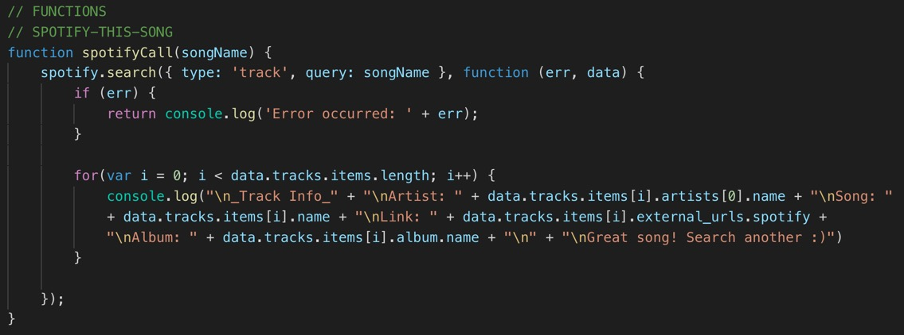
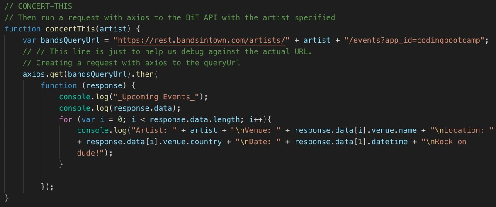
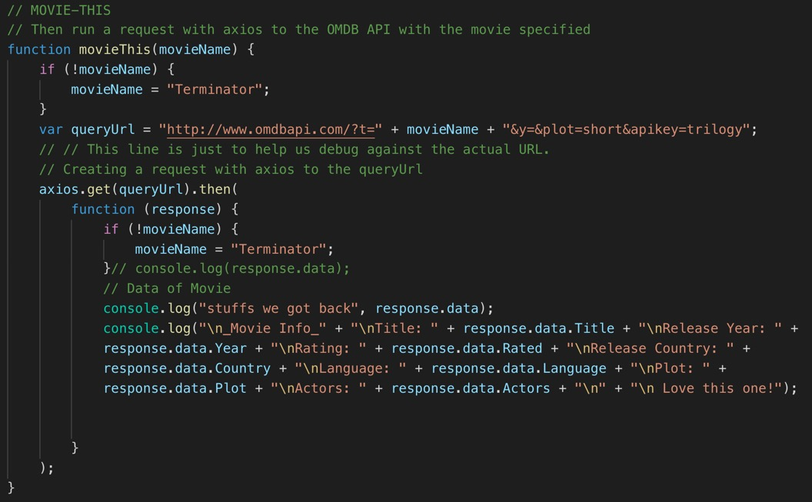

## liri-node-app
Language Interpretation and Recognition Interface

## Screen Shots

LIRI will search Spotify for songs, Bands in Town for concerts, and OMDB for movies. To retrieve the data that will power this app, you'll need to send requests using the axios package to the Bands in Town, Spotify and OMDB APIs which are listed below in #Technology/API used# section.

## Uses 
LIRI Bot is CLI node app that will help you finding the followings:

* Song information using the command: spotify-this-song "insert song you want to search" 
* Movie information using the command: movie-this "insert movie you want to search"
* Upcoming concerts using the command: concert-this "insert artist you want to search"

Note that quotations are needed for artists, movies, and songs longer than 1 word. See the screen shots in the folder assets/images/spotifyThis for song search, assets/images/movie-this for movies, and assets/images/concertThis for concert search.  In order for you to be able to search in CLI, you will need to install the following APIs. 

## Technology/API used
* Node-Spotify-API
* Axios
* Moment
* DotEnv You'll need keys for these APIs
* BandsinTown API
* Spotify API
* OMDB API

## Author
Chet Budhathoki

## License
No license is required to use this app.
